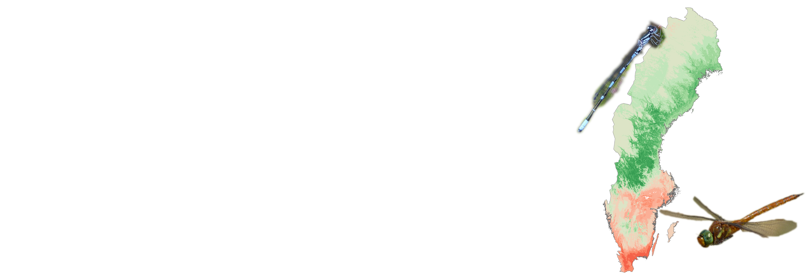

# Swedish odonate maps

The goal of this repository is to give access to **ecological niche models** (ENMs) of Swedish odonate species through maps and a **R Shiny app**. Both **present-day** and **future models** are available allowing local observers to **target under-surveyed** but **potentially favorable areas**.

The Shiny app to browse species maps can be accessed [**here**](https://matpelissie.shinyapps.io/Artportalen_odonate_maps/).

At the moment, the visualisation is limited to <ins>5 dragonfly species</ins> with highest threatening status. Mostly climate variables have been used to build the ENM, not local availability of suitable habitats. Further details about methods and overall results can be found in the following publication:

Pushed Northward by Climate Change: Range Shifts With a Chance of Co-occurrence Reshuffling in the Forecast for Northern European Odonates. **Mathieu Pélissié**, **Frank Johansson**, **Chaz Hyseni**. *Environmental Entomology*, **51**(5), 2022, pp. 910--921, <https://doi.org/10.1093/ee/nvac056>
